# 网络联机五子棋对战系统 - 开发文档

## 项目概述

### 1.1 项目简介
本项目是一款基于 Qt 5.15+ 开发的网络联机五子棋对战系统，支持单机AI对战、在线玩家对战、观战系统等功能。采用 C/S 架构，使用 Reactor 网络模型、Redis 缓存、MySQL 数据库和 Protobuf 序列化协议。

### 1.2 核心功能
- **单机模式**：与AI进行五子棋对战
- **联机对战**：通过房间号或随机匹配与其他玩家对战
- **社交系统**：大厅聊天、私聊、房间内聊天
- **房间系统**：支持房间创建、加密房间、房间号加入
- **排行榜**：显示玩家胜利场次、胜率等数据
- **观战系统**：允许其他玩家观看正在进行的对局

### 1.3 技术栈

| 技术 | 用途 |
|------|------|
| Qt | GUI框架、网络通信 |
| C++ | 编程语言 |
| Protobuf | 数据序列化 |
| MySQL | 用户数据、战绩存储 |
| Redis | 在线用户、房间缓存 |
| Reactor模式 | 网络I/O多路复用 |

---

## 第二章 系统架构设计

### 2.1 总体架构

系统采用 **三层架构 + Reactor网络模型**：

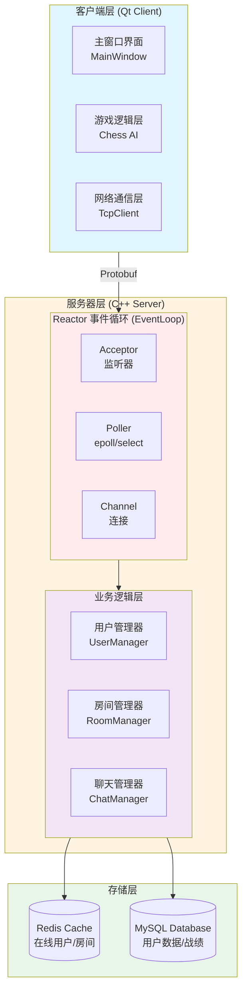

### 2.2 客户端架构

#### 2.2.1 模块划分

```
Client/
├── UI Layer (界面层)
│   ├── MainWindow           # 主窗口（整合所有界面）
│   ├── LobbyWidget          # 大厅界面
│   ├── RoomWidget           # 房间界面
│   ├── ChatWidget           # 聊天窗口
│   └── RankWidget           # 排行榜窗口
│
├── Game Logic (游戏逻辑层)
│   ├── Chess                # 五子棋规则
│   ├── AIEngine             # AI引擎
│   ├── GameController       # 游戏控制器
│   └── ReplayManager        # 回放管理
│
├── Network Layer (网络层)
│   ├── TcpClient            # TCP客户端
│   ├── ProtobufCodec        # Protobuf编解码
│   └── MessageDispatcher    # 消息分发器
│
└── Data Layer (数据层)
    ├── UserProfile          # 用户信息
    ├── RoomInfo             # 房间信息
    └── LocalCache           # 本地缓存
```

#### 2.2.2 MainWindow 职责

MainWindow 作为唯一的主界面类，整合所有功能：

- **棋盘绘制**：通过内嵌的 BoardWidget 绘制棋盘
- **游戏控制**：管理游戏流程（单机/联机切换）
- **界面切换**：管理大厅、房间、排行榜等子界面
- **网络通信**：与服务器交互，处理网络消息
- **状态管理**：维护当前用户状态、房间状态

### 2.3 服务器架构

#### 2.3.1 Reactor 网络模型

服务器采用 **单 Reactor + 线程池** 模型：

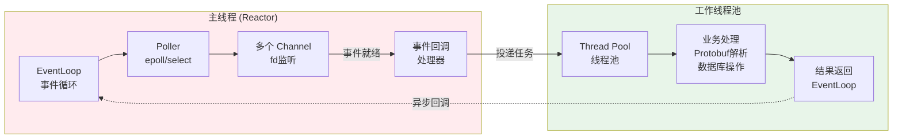

**核心组件**：

| 组件 | 职责 |
|------|------|
| EventLoop | 事件循环，驱动 Poller |
| Poller | 封装 epoll/select，监听文件描述符 |
| Channel | 封装 fd 和事件回调函数 |
| Acceptor | 监听新连接，创建 Connection |
| Connection | 管理单个 TCP 连接，处理读写 |
| ThreadPool | 处理 CPU 密集型任务 |

#### 2.3.2 服务器模块设计

```
Server/
├── Network (网络层)
│   ├── Reactor/
│   │   ├── EventLoop        # 事件循环
│   │   ├── Poller           # I/O多路复用
│   │   ├── Channel          # 通道
│   │   ├── Acceptor         # 接受器
│   │   └── TcpConnection    # TCP连接
│   │
│   └── Protocol/
│       ├── ProtobufCodec    # Protobuf编解码
│       └── MessageHandler   # 消息处理
│
├── Business (业务层)
│   ├── UserManager          # 用户管理
│   ├── RoomManager          # 房间管理
│   ├── MatchManager         # 匹配管理
│   ├── ChatManager          # 聊天管理
│   └── SpectatorManager     # 观战管理
│
├── Storage (存储层)
│   ├── RedisClient          # Redis客户端
│   ├── MySQLClient          # MySQL客户端
│   └── DataModel/
│       ├── User             # 用户数据模型
│       ├── Room             # 房间数据模型
│       └── GameRecord       # 对局记录模型
│
└── Utils (工具层)
    ├── ThreadPool           # 线程池
    ├── Logger               # 日志系统
    └── Timestamp            # 时间戳工具
```

---

## 第三章 数据流程设计

### 3.1 用户登录流程

**流程说明**：用户通过客户端输入用户名和密码，服务器验证后返回登录结果，成功则将用户信息缓存到Redis并返回Token。

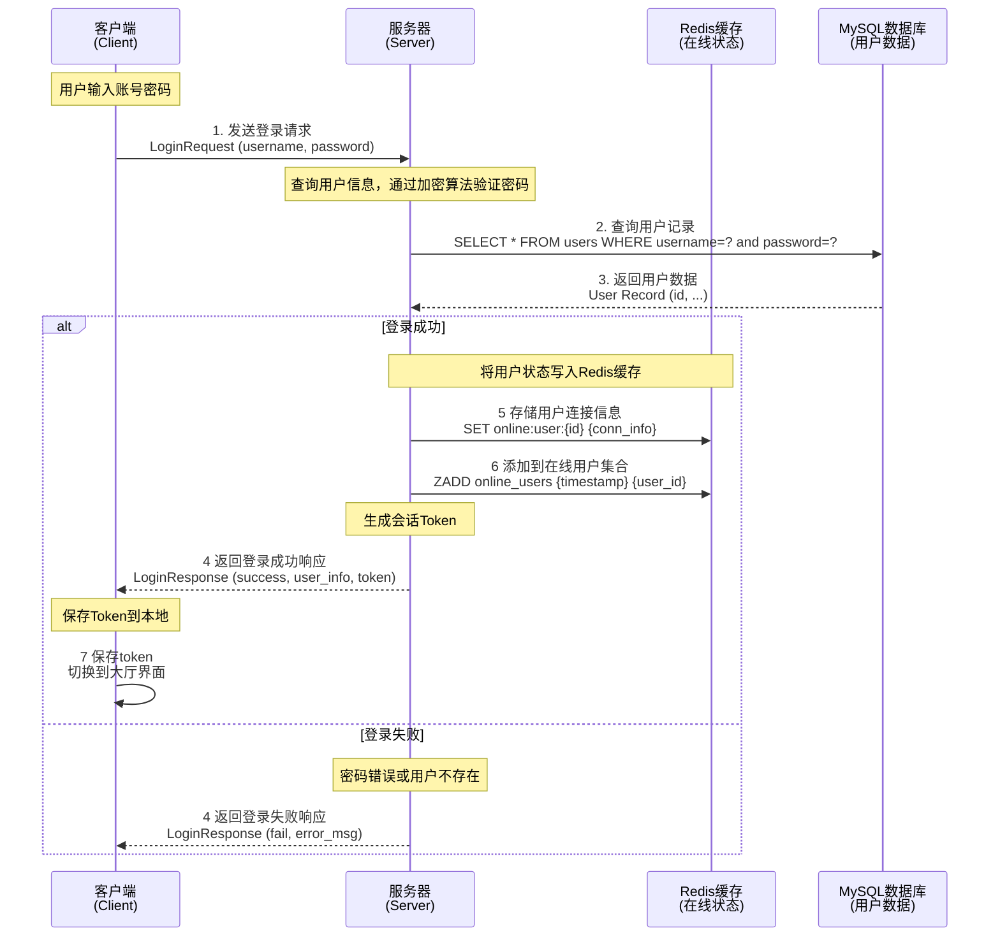

**关键步骤解析**：
- **步骤1-3**：客户端发送登录请求，服务器从MySQL查询用户信息
- **步骤4**：验证密码
- **步骤5-6**：登录成功后将用户状态缓存到Redis，支持快速查询在线用户
- **步骤7**：返回Token供后续请求验证身份

### 3.2 创建房间流程

**流程说明**：玩家在大厅创建房间，服务器生成唯一房间号并存储到Redis，然后广播更新房间列表给所有在线用户。

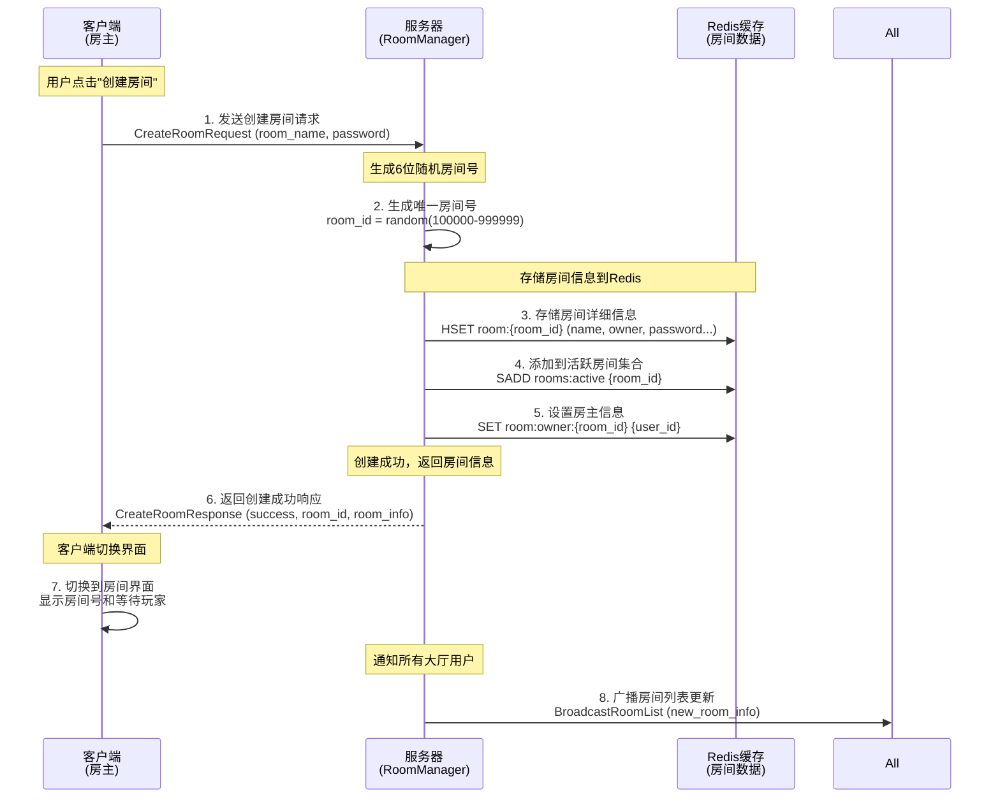

**关键步骤解析**：
- **步骤2**：使用随机算法生成6位数字房间号，确保唯一性
- **步骤3-5**：将房间信息存储到Redis，包括房间名、房主、密码（可选）等
- **步骤8**：使用广播机制通知所有在大厅的用户，实时更新房间列表

### 3.3 加入房间流程

**流程说明**：玩家通过房间号加入房间，服务器验证房间状态、密码等条件，成功后将玩家添加到房间并通知房间内所有成员。

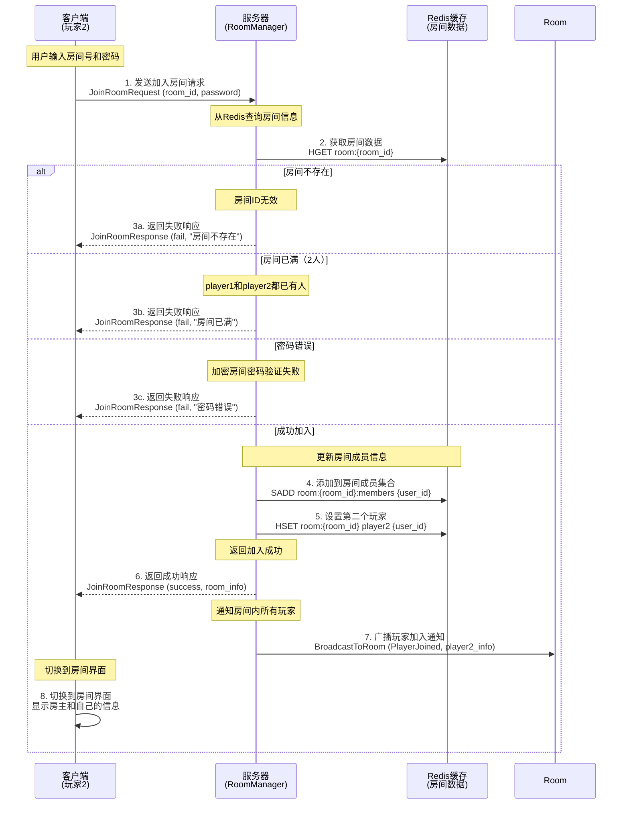

**关键步骤解析**：
- **步骤2**：先从Redis查询房间是否存在，快速响应
- **步骤3a-3c**：多种失败情况的判断：房间不存在、已满、密码错误
- **步骤4-5**：将新玩家添加到房间成员集合和玩家位置
- **步骤7**：通知房间内的房主，显示"玩家2已加入"

### 3.4 对战流程

**流程说明**：双方玩家轮流落子，服务器验证每一步的合法性并检查胜负，同时实时同步棋局状态给所有观战者。

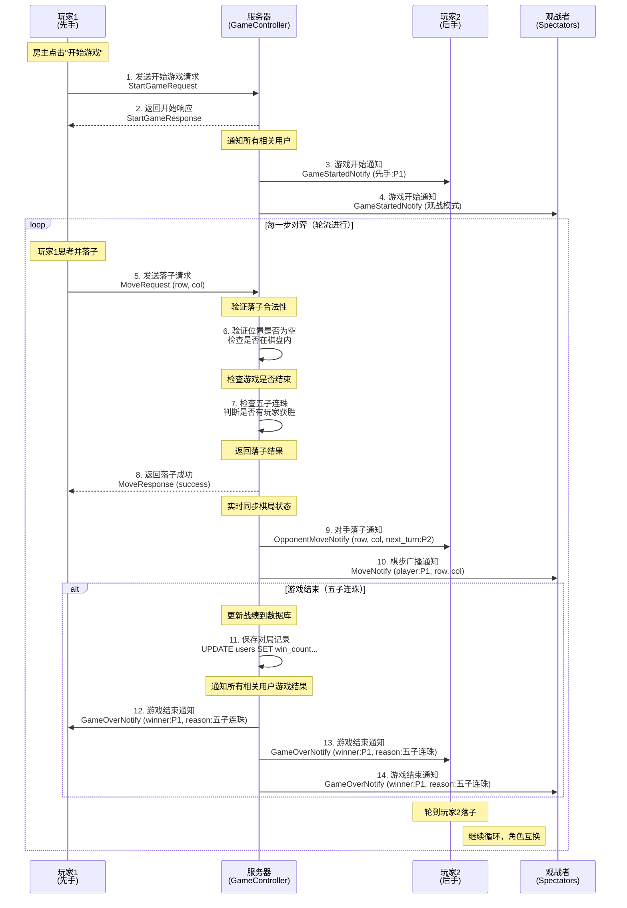

**关键步骤解析**：
- **步骤5-7**：服务器验证每一步的合法性（位置是否为空、是否在棋盘内），并实时检查胜负
- **步骤9-10**：使用广播机制同步棋局状态给对手和所有观战者
- **步骤11-14**：游戏结束时更新MySQL中的战绩，并通知所有相关用户
- **循环机制**：双方轮流落子，直到分出胜负或平局

### 3.5 随机匹配流程

**流程说明**：玩家选择随机匹配，服务器将其加入匹配队列，当队列中有两个或以上玩家时自动配对并创建对战房间。

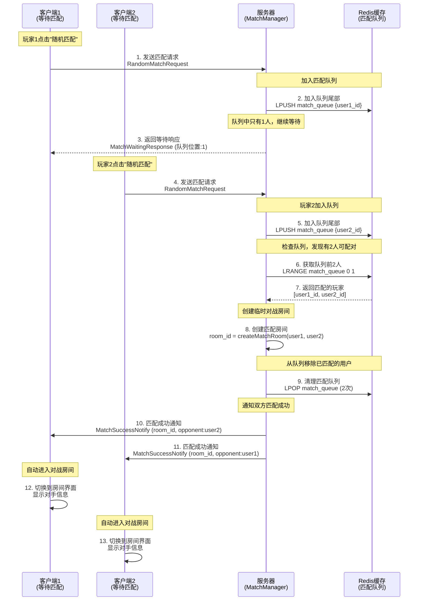

**关键步骤解析**：
- **步骤2-3**：第一个玩家加入队列后进入等待状态，显示"正在匹配中..."
- **步骤6-7**：使用Redis的LRANGE命令检查队列头部，发现有2人时触发配对
- **步骤8**：自动创建临时房间，无需玩家手动创建
- **步骤9**：从队列中移除已配对的玩家，防止重复匹配
- **匹配策略**：采用先进先出（FIFO）策略，确保公平性

### 3.6 聊天消息流程

**流程说明**：支持三种聊天模式（大厅聊天、私聊、房间聊天），消息通过Redis缓存并实时广播给目标用户。

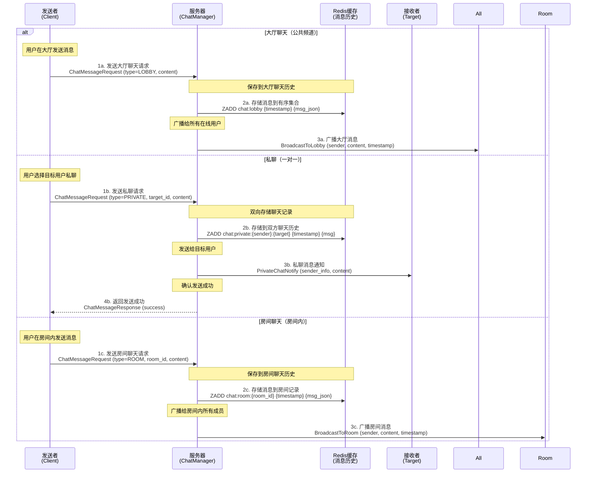

**关键步骤解析**：
- **大厅聊天**：使用广播机制，所有在大厅的用户都能收到消息
- **私聊**：点对点通信，使用双向存储确保双方都能查看历史记录
- **房间聊天**：只有房间内成员和观战者能看到消息
- **消息持久化**：使用Redis的有序集合（ZADD）按时间戳存储，支持历史消息查询
- **消息格式**：包含发送者信息、内容、时间戳等，便于客户端渲染

### 3.7 观战流程

**流程说明**：用户可以观看正在进行的对局，服务器发送历史棋步并实时同步后续的每一步落子。

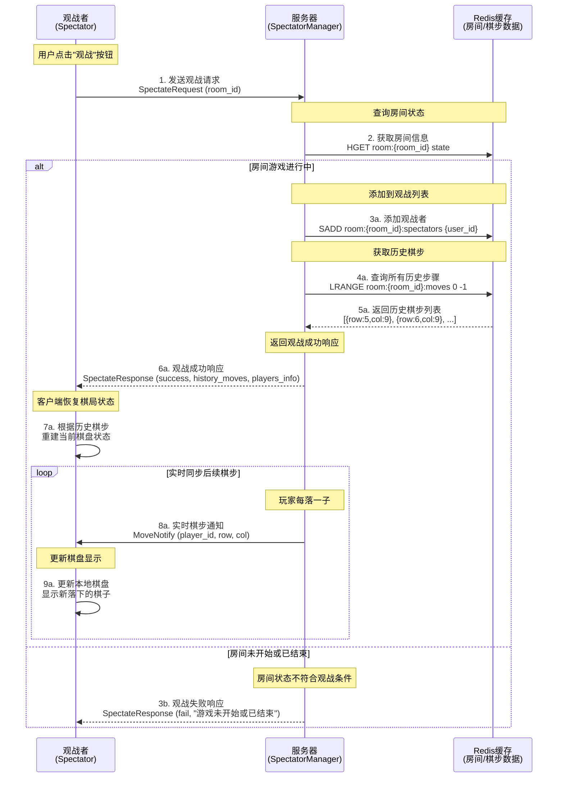

**关键步骤解析**：
- **步骤2**：先检查房间状态，只有GAMING状态才允许观战
- **步骤3-5**：将观战者添加到Redis集合，并获取所有历史棋步
- **步骤7**：客户端根据历史棋步重建棋盘，让观战者看到当前局势
- **步骤8-9**：建立实时同步通道，每当玩家落子，观战者立即收到通知
- **观战特性**：观战者只能观看，无法操作棋盘，也无法影响对局

---

## 第四章 类图设计

### 4.1 客户端核心类图

**设计说明**：客户端采用MVC架构，MainWindow作为主控制器整合UI、游戏逻辑和网络通信三大模块。

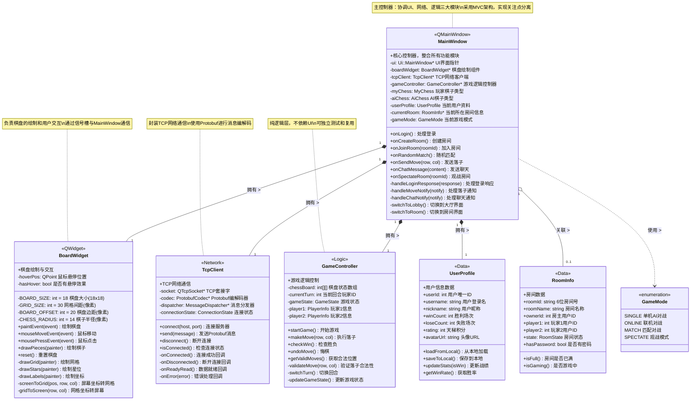

**类关系说明**：
- **组合关系（实心菱形）**：MainWindow拥有BoardWidget、TcpClient、GameController的完整生命周期
- **聚合关系（空心菱形）**：MainWindow与RoomInfo是弱关联，RoomInfo可以独立存在
- **依赖关系（虚线箭头）**：MainWindow使用GameMode枚举类型
- **信号槽通信**：BoardWidget通过Qt的信号槽机制与MainWindow解耦

**设计模式应用**：
- **MVC模式**：MainWindow(Controller) + BoardWidget(View) + GameController(Model)
- **单一职责原则**：每个类只负责一个明确的功能
- **依赖倒置原则**：通过接口和信号槽降低耦合度

### 4.2 服务器核心类图

**设计说明**：服务器采用分层设计，GameServer为顶层协调者，通过各个Manager模块管理不同业务逻辑。

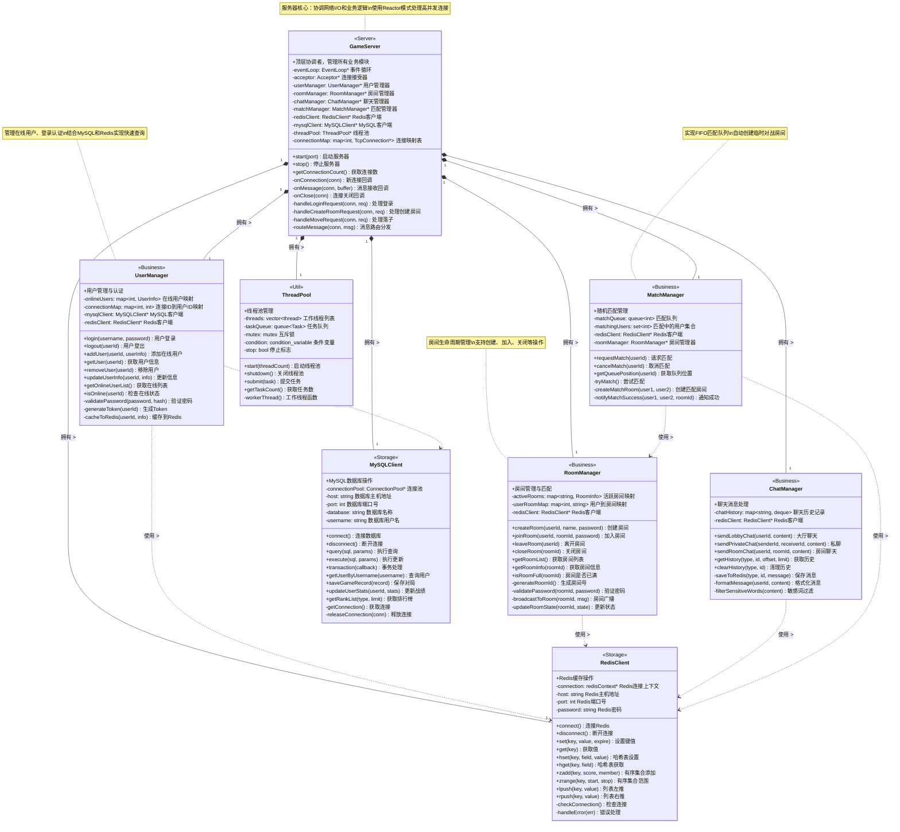

**模块职责说明**：
- **GameServer**：服务器核心，负责网络I/O、消息路由和模块协调
- **UserManager**：用户管理（登录认证、在线状态、用户信息）
- **RoomManager**：房间管理（创建、加入、离开、广播）
- **ChatManager**：聊天管理（大厅聊天、私聊、房间聊天）
- **MatchManager**：匹配管理（队列维护、自动匹配、房间创建）
- **RedisClient**：Redis操作封装（缓存、队列、有序集合）
- **MySQLClient**：MySQL操作封装（用户数据、对局记录、排行榜）
- **ThreadPool**：线程池管理（异步任务处理、数据库操作）

**分层架构**：
```
┌─────────────────────────────────────┐
│        GameServer (协调层)           │
├─────────────────────────────────────┤
│  Business Layer (业务逻辑层)         │
│  - UserManager                      │
│  - RoomManager                      │
│  - ChatManager                      │
│  - MatchManager                     │
├─────────────────────────────────────┤
│  Storage Layer (存储层)              │
│  - RedisClient (缓存)               │
│  - MySQLClient (持久化)             │
├─────────────────────────────────────┤
│  Util Layer (工具层)                 │
│  - ThreadPool (异步处理)            │
└─────────────────────────────────────┘
```

### 4.3 Reactor 网络模型类图

**设计说明**：采用经典的Reactor模式，通过EventLoop驱动I/O多路复用，实现高并发非阻塞网络通信。

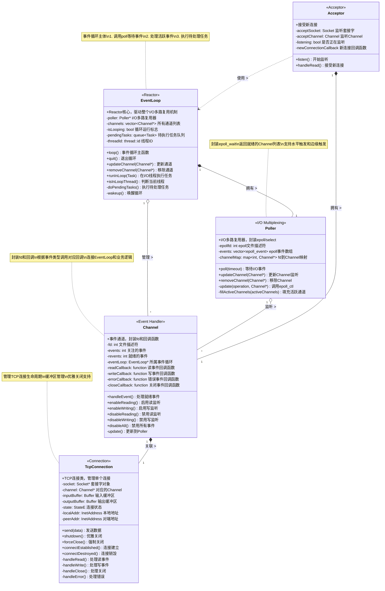

**Reactor模式工作流程**：
1. **EventLoop::loop()**：主循环调用 `poller->poll()` 等待事件
2. **Poller::poll()**：使用 `epoll_wait()` 监听所有注册的fd
3. **事件就绪**：`epoll_wait()` 返回活跃的Channel列表
4. **Channel::handleEvent()**：根据事件类型调用对应回调函数
5. **TcpConnection**：在回调中处理实际的读写业务逻辑

**关键优势**：
- **高并发**：一个线程通过epoll管理成千上万个连接
- **非阻塞**：所有I/O操作都是非阻塞的，不会阻塞主循环
- **事件驱动**：基于事件触发，减少无效的轮询开销

### 4.4 数据模型类图

**设计说明**：定义核心数据模型，支持与Protobuf和数据库之间的序列化转换。

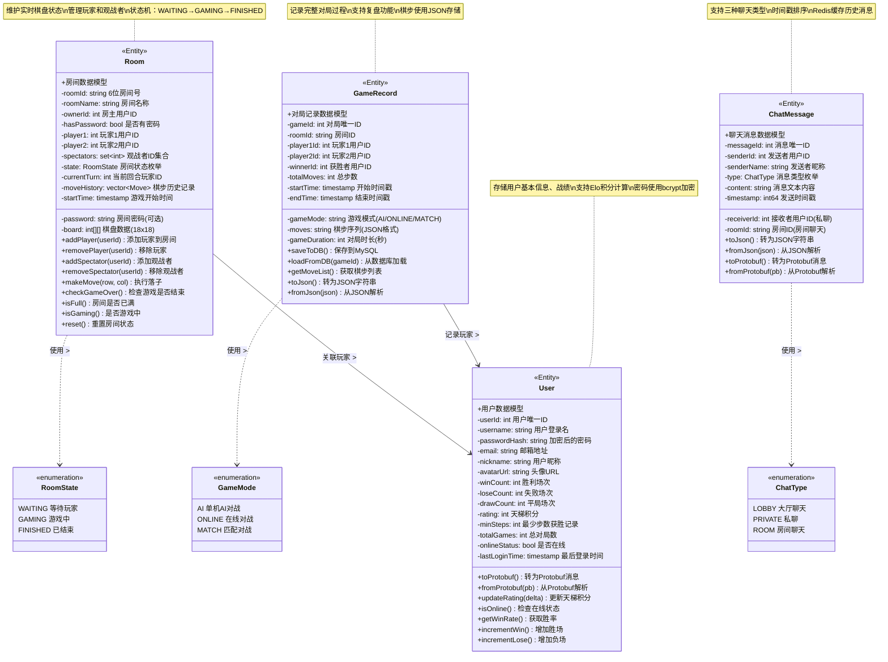

**数据模型说明**：

1. **User（用户模型）**
   - 存储用户的基本信息、战绩数据和在线状态
   - 支持计算天梯积分（Elo Rating算法）
   - 密码使用bcrypt加密存储

2. **Room（房间模型）**
   - 包含房间基本信息、玩家列表、观战者集合
   - 维护实时的棋盘状态（18x18二维数组）
   - 状态机管理：WAITING → GAMING → FINISHED

3. **GameRecord（对局记录）**
   - 记录完整的对局过程，支持复盘功能
   - 棋步数据使用JSON格式存储，便于解析
   - 保存到MySQL，用于历史查询和统计分析

4. **ChatMessage（聊天消息）**
   - 支持三种聊天类型：大厅、私聊、房间
   - 使用时间戳排序，便于按时间查询历史消息
   - JSON序列化后存储到Redis

---

## 第五章 数据库设计

### 5.1 MySQL 数据表设计

#### 5.1.1 users 表（用户信息）

```sql
CREATE TABLE users (
    user_id INT PRIMARY KEY AUTO_INCREMENT,
    username VARCHAR(50) UNIQUE NOT NULL,
    password_hash VARCHAR(255) NOT NULL,
    email VARCHAR(100),
    nickname VARCHAR(50),
    avatar_url VARCHAR(255),
    win_count INT DEFAULT 0,
    lose_count INT DEFAULT 0,
    draw_count INT DEFAULT 0,
    rating INT DEFAULT 1000,
    min_steps INT DEFAULT 0,
    total_games INT DEFAULT 0,
    created_at TIMESTAMP DEFAULT CURRENT_TIMESTAMP,
    last_login TIMESTAMP,
    INDEX idx_username (username),
    INDEX idx_rating (rating DESC)
) ENGINE=InnoDB DEFAULT CHARSET=utf8mb4;
```

#### 5.1.2 game_records 表（对局记录）

```sql
CREATE TABLE game_records (
    game_id BIGINT PRIMARY KEY AUTO_INCREMENT,
    room_id VARCHAR(20),
    player1_id INT NOT NULL,
    player2_id INT NOT NULL,
    winner_id INT,
    game_mode ENUM('AI', 'ONLINE', 'MATCH') DEFAULT 'ONLINE',
    moves_data TEXT,
    total_moves INT,
    start_time TIMESTAMP,
    end_time TIMESTAMP,
    game_duration INT,
    INDEX idx_player1 (player1_id),
    INDEX idx_player2 (player2_id),
    INDEX idx_start_time (start_time DESC),
    FOREIGN KEY (player1_id) REFERENCES users(user_id),
    FOREIGN KEY (player2_id) REFERENCES users(user_id)
) ENGINE=InnoDB DEFAULT CHARSET=utf8mb4;
```

#### 5.1.3 chat_history 表（聊天记录）

```sql
CREATE TABLE chat_history (
    message_id BIGINT PRIMARY KEY AUTO_INCREMENT,
    sender_id INT NOT NULL,
    receiver_id INT,
    room_id VARCHAR(20),
    message_type ENUM('LOBBY', 'PRIVATE', 'ROOM') NOT NULL,
    content TEXT NOT NULL,
    send_time TIMESTAMP DEFAULT CURRENT_TIMESTAMP,
    INDEX idx_sender (sender_id, send_time),
    INDEX idx_room (room_id, send_time),
    FOREIGN KEY (sender_id) REFERENCES users(user_id)
) ENGINE=InnoDB DEFAULT CHARSET=utf8mb4;
```

### 5.2 Redis 数据结构设计

#### 5.2.1 在线用户管理

```redis
# 在线用户集合（有序集合，按登录时间排序）
ZADD online_users {timestamp} {user_id}

# 用户连接信息（哈希表）
HSET user:connection:{user_id}
    "conn_id" {connection_id}
    "ip" {ip_address}
    "login_time" {timestamp}
    "status" "ONLINE/LOBBY/GAMING"

# 用户会话Token
SET user:token:{token} {user_id} EX 86400
```

#### 5.2.2 房间管理

```redis
# 活跃房间集合
SADD rooms:active {room_id}

# 房间详细信息（哈希表）
HSET room:{room_id}
    "room_name" {name}
    "owner_id" {user_id}
    "password" {encrypted_password}
    "player1" {user_id}
    "player2" {user_id}
    "state" "WAITING/GAMING/FINISHED"
    "current_turn" {user_id}
    "start_time" {timestamp}

# 房间成员列表
SADD room:{room_id}:members {user_id1} {user_id2}

# 观战者列表
SADD room:{room_id}:spectators {user_id}

# 对局棋步记录（列表）
RPUSH room:{room_id}:moves {move_json}
```

#### 5.2.3 匹配队列

```redis
# 随机匹配队列
LPUSH match_queue {user_id}

# 匹配中的用户（避免重复匹配）
SADD matching_users {user_id} EX 300
```

#### 5.2.4 聊天缓存

```redis
# 大厅聊天记录（有序集合，最多保留1000条）
ZADD chat:lobby {timestamp} {message_json}
ZREMRANGEBYRANK chat:lobby 0 -1001

# 房间聊天记录
ZADD chat:room:{room_id} {timestamp} {message_json}

# 私聊消息（双向存储）
ZADD chat:private:{user1}:{user2} {timestamp} {message_json}
```

---

## 第六章 Protobuf 协议设计

### 6.1 消息类型枚举

```protobuf
syntax = "proto3";
package gomoku;

enum MessageType {
    // 认证相关 (1-99)
    LOGIN_REQUEST = 1;
    LOGIN_RESPONSE = 2;
    REGISTER_REQUEST = 3;
    REGISTER_RESPONSE = 4;
    LOGOUT_REQUEST = 5;

    // 房间相关 (100-199)
    CREATE_ROOM_REQUEST = 100;
    CREATE_ROOM_RESPONSE = 101;
    JOIN_ROOM_REQUEST = 102;
    JOIN_ROOM_RESPONSE = 103;
    LEAVE_ROOM_REQUEST = 104;
    ROOM_LIST_REQUEST = 105;
    ROOM_LIST_RESPONSE = 106;

    // 游戏相关 (200-299)
    START_GAME_REQUEST = 200;
    MOVE_REQUEST = 201;
    MOVE_RESPONSE = 202;
    MOVE_NOTIFY = 203;
    GAME_OVER_NOTIFY = 204;
    UNDO_REQUEST = 205;

    // 匹配相关 (300-399)
    RANDOM_MATCH_REQUEST = 300;
    MATCH_SUCCESS_NOTIFY = 301;
    CANCEL_MATCH_REQUEST = 302;

    // 聊天相关 (400-499)
    CHAT_MESSAGE_REQUEST = 400;
    CHAT_MESSAGE_NOTIFY = 401;

    // 观战相关 (500-599)
    SPECTATE_REQUEST = 500;
    SPECTATE_RESPONSE = 501;
    SPECTATOR_JOIN_NOTIFY = 502;

    // 排行榜 (600-699)
    RANK_LIST_REQUEST = 600;
    RANK_LIST_RESPONSE = 601;
}
```

### 6.2 核心消息定义

```protobuf
// 登录请求
message LoginRequest {
    string username = 1;
    string password = 2;
}

// 登录响应
message LoginResponse {
    bool success = 1;
    string error_msg = 2;
    string token = 3;
    UserInfo user_info = 4;
}

// 用户信息
message UserInfo {
    int32 user_id = 1;
    string username = 2;
    string nickname = 3;
    string avatar_url = 4;
    int32 win_count = 5;
    int32 lose_count = 6;
    int32 rating = 7;
}

// 创建房间请求
message CreateRoomRequest {
    string room_name = 1;
    string password = 2;  // 可选，为空则无密码
}

// 创建房间响应
message CreateRoomResponse {
    bool success = 1;
    string error_msg = 2;
    RoomInfo room_info = 3;
}

// 房间信息
message RoomInfo {
    string room_id = 1;
    string room_name = 2;
    int32 owner_id = 3;
    bool has_password = 4;
    RoomState state = 5;
    UserInfo player1 = 6;
    UserInfo player2 = 7;
    int32 spectator_count = 8;
}

enum RoomState {
    WAITING = 0;
    GAMING = 1;
    FINISHED = 2;
}

// 落子请求
message MoveRequest {
    int32 row = 1;
    int32 col = 2;
}

// 落子响应
message MoveResponse {
    bool success = 1;
    string error_msg = 2;
}

// 落子通知
message MoveNotify {
    int32 player_id = 1;
    int32 row = 2;
    int32 col = 3;
    int32 next_turn_player_id = 4;
}

// 游戏结束通知
message GameOverNotify {
    int32 winner_id = 1;
    GameOverReason reason = 2;
    int32 total_moves = 3;
}

enum GameOverReason {
    FIVE_IN_ROW = 0;
    OPPONENT_QUIT = 1;
    TIMEOUT = 2;
}

// 聊天消息请求
message ChatMessageRequest {
    ChatType type = 1;
    int32 target_id = 2;  // 私聊目标用户ID
    string room_id = 3;   // 房间ID
    string content = 4;
}

enum ChatType {
    LOBBY = 0;
    PRIVATE = 1;
    ROOM = 2;
}

// 聊天消息通知
message ChatMessageNotify {
    ChatType type = 1;
    int32 sender_id = 2;
    string sender_name = 3;
    string content = 4;
    int64 timestamp = 5;
}

// 观战请求
message SpectateRequest {
    string room_id = 1;
}

// 观战响应
message SpectateResponse {
    bool success = 1;
    string error_msg = 2;
    RoomInfo room_info = 3;
    repeated Move history_moves = 4;
}

message Move {
    int32 row = 1;
    int32 col = 2;
    int32 player_id = 3;
}

// 排行榜请求
message RankListRequest {
    RankType type = 1;
    int32 offset = 2;
    int32 limit = 3;
}

enum RankType {
    WIN_COUNT = 0;
    RATING = 1;
    WIN_RATE = 2;
}

// 排行榜响应
message RankListResponse {
    repeated RankEntry entries = 1;
    int32 total_count = 2;
}

message RankEntry {
    int32 rank = 1;
    UserInfo user_info = 2;
    int32 value = 3;
}
```

